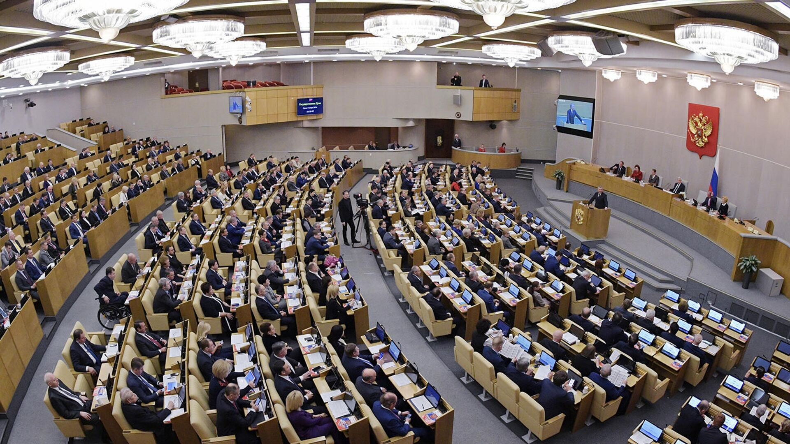

# CO-SPONSORSHIP NETWORKS IN THE LEGISLATIVE PROCESS: ANALYSIS OF THE RUSSIAN STATE DUMA

### Project Description:

Nowadays, political processes are of growing interest as a research area to network scholars. Prior studies validate that the social ties between various political actors (eg., individual deputies or parties) affect significantly on both policy initiatives and legislation (Zuckerman, 2005). Frequently, members of different political parties can cooperate on the basis of close interests and form network of coalitions that result, for instance, in legislative co-sponsorship. This thesis can be supported by the data of Wilson and Young (1997), emphasizing that 58.2% of bills introduced in the U.S. Congress (bicameral parliament) by lawmakers were co-sponsored. Thus, for well-established legislative institutions, co-authorship is a normal practice. However, what is the situation in relatively young legislatures?

In this study we focused on examining networks of legislative co-sponsorship in the State Duma,  the lower house of the Federal Assembly of Russia, the 1st convocation of which began on December 1993. Currently, the 8th convocation of the Duma is formed by five parties, which is the first time since 1999 (see Appendix). The State Duma consists of 450 seats. As a result of the past election 2021 half of all deputies (225) were elected under single-mandate constituencies, while the other half under party lists.  As a rule, deputies prefer to co-sponsor bills, thus establishing parliamentary coalitions in order to jointly initiate consideration of the bill in the State Duma. Tolmacheva (2021) confirms that point, revealing a high level of legislative co-authorship both among one-party members and among members of different factions.

Our aspiration in studying legislative co-sponsorship networks is motivated by the following reasons. First, the parliamentary ties of the State Duma are a complex and heterogeneous system of relationships between multiple interest groups and individuals. Second, the current composition of the Duma has been noticeably renewed. According to State Duma Speaker Vyacheslav Volodin, 48.5% of 450 elected deputies are newcomers. Consequently, having no relevant background in federal lawmaking, new deputies may collaborate with more experienced colleagues. Third, co-authorship can signal underlying agreements even between members of competing factions. Network analysis, therefore, can be applied for observing various social ties that deputies create between each other through the co-sponsorship of bills and laws.
