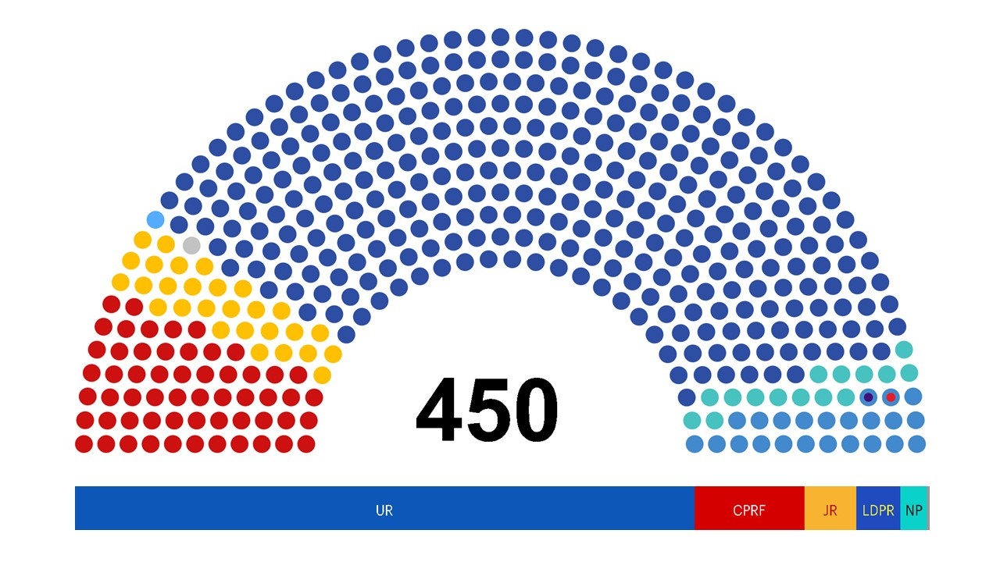
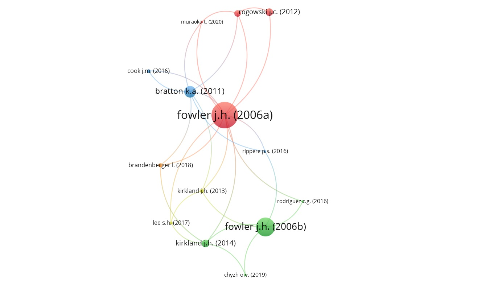

# CO-SPONSORSHIP NETWORKS IN THE LEGISLATIVE PROCESS: ANALYSIS OF THE RUSSIAN STATE DUMA

## Overview

In this study we attempt to explore a complex system of co-sponsorship relationships between deputies of the State Duma of Russian Federation applying social network analysis (SNA).

## Table of contents

1. [Introduction](#introduction)  
2. [Literature review](#literature-review)
3. [Data and methodology](#data-and-methodology)
4. [Results](#results)
5. [Conclusion](#conclusion)    
<a name="headers"/>

## Introduction

### Problem statement

Nowadays, political processes are of growing interest as a research area to network scholars. Prior studies validate that the social ties between various political actors (eg., individual deputies or parties) affect significantly on both policy initiatives and legislation (Zuckerman, 2005). Frequently, members of different political parties can cooperate on the basis of close interests and form network of coalitions that result, for instance, in legislative co-sponsorship. This thesis can be supported by the data of Wilson and Young (1997), emphasizing that 58.2% of bills introduced in the U.S. Congress (bicameral parliament) by lawmakers were co-sponsored. Thus, for well-established legislative institutions, co-authorship is a normal practice. However, what is the situation in relatively young legislatures?

In this study we focused on examining networks of legislative co-sponsorship in the State Duma,  the lower house of the Federal Assembly of Russia, the 1st convocation of which began on December 1993. Currently, the 8th convocation of the Duma is formed by five parties, which is the first time since 1999 (Figure 1). The State Duma consists of 450 seats. As a result of the past election 2021 half of all deputies (225) were elected under single-mandate constituencies, while the other half under party lists.  As a rule, deputies prefer to co-sponsor bills, thus establishing parliamentary coalitions in order to jointly initiate consideration of the bill in the State Duma. Tolmacheva (2021) confirms that point, revealing a high level of legislative co-authorship both among one-party members and among members of different factions.

#### Figure 2. Composition of the 8th convocation of the State Duma.

*Source: http://duma.gov.ru/news/52271/*

### Research Motivation

Our aspiration in studying legislative co-sponsorship networks is motivated by the following reasons. First, the parliamentary ties of the State Duma are a complex and heterogeneous system of relationships between multiple interest groups and individuals. Second, the current composition of the Duma has been noticeably renewed. According to State Duma Speaker Vyacheslav Volodin, 48.5% of 450 elected deputies are newcomers. Consequently, having no relevant background in federal lawmaking, new legislators may collaborate with more experienced colleagues. Third, co-authorship can signal underlying agreements even between members of competing factions. Network analysis, therefore, can be applied for observing various social ties that deputies create between each other through the co-sponsorship of bills and laws.

### Research questions

More specifically, the purpose of the study is to answer three main research questions:
- What is the overall degree of legislative co-sponsorship in the current convocation of the State Duma?
- What parliamentary coalitions exist and on what basis are they built?
- Is there a correlation between the deputy’s credibility and co-sponsorship?

To cover these research questions, the study utilizes qualitative and quantitative methods. We will use social network analysis (SNA) as a major approach of inspecting legislative co-sponsorship relations. We employ Python programming language to perform a wide range of data manipulations and Gephi software as a graph visualization tool. All the necessary data was collected directly from the State Duma official website as .csv dataset and then preprocessed with Python.

### Structure

The study is divided into four parts. 
  [Part 1](#introduction) introduces the problem of legislative co-sponsorship, provides the author’s motivation and states research questions. 
  [Part 2](#literature-review) represents the literature review, which is based on discussing of previous studies on the topic and identifying of gaps. 
  [Part 3](#data-and-methodology) describes the data collection process and research methodology. 
  [Part 4](#results) contains the results obtained. 
  [Part 5](#conclusion) draws the final conclusion, suggests further research application, assumes study’s value for practical purposes.

## Literature review

Considering the network of the most cited scholars on the topic from Scopus we can see that James Fowler is cited more commonly (Figure 2). Plus, the US authors are the undisputed leaders in the field of legislative co-sponsorhip research.

#### Figure 2. Most popular authors in the legislative co-sponsorhip networks area.

*Built with [VOSViewer](https://www.vosviewer.com/).*

### Specific of legislative co-sponsorship

Exploring of legislative co-sponsorship networks is a well-developed area of research, especially in the United States. One of the pioneers, James Fowler, made a significant contribution by conducting extensive studies of the legislation co-sponsorship in the U.S. Congress. In his 2006 study, he determined that bills supported by a single co-sponsor passed 10% of the time, while bills co-sponsored by an average of 48.5% of the chamber passed 30% of the time. Obviously, the probability of passing a bill is higher when it is supported by a greater number of deputies. The reason for this trend, according to Koger (2003), may be the reward factor, under the incentive of which deputies often support bills that popular or supported by powerful groups. 

## Data and methodology

## Results

## Conclusion
