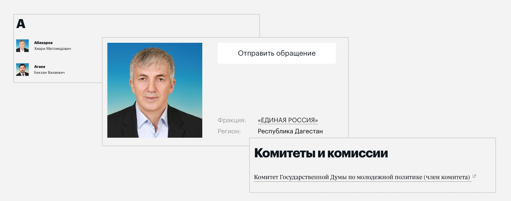
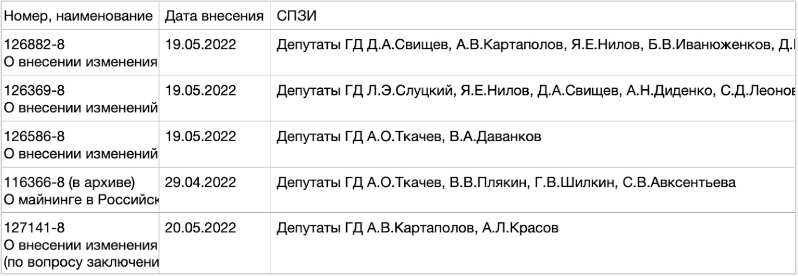
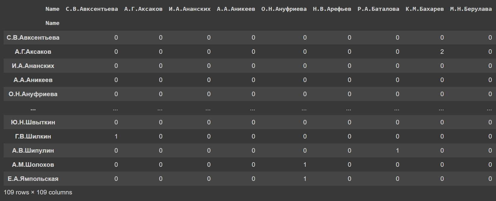
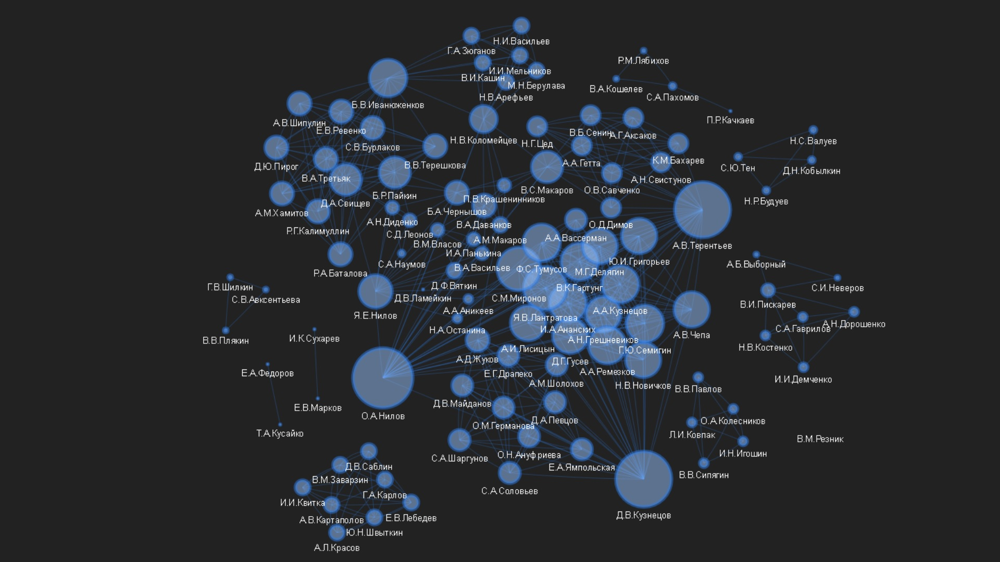

# CO-SPONSORSHIP NETWORKS IN THE LEGISLATIVE PROCESS: ANALYSIS OF THE RUSSIAN STATE DUMA

[](https://spb.hse.ru/en/)

## Overview

In this study we attempt to explore a complex system of co-sponsorship relationships between deputies of the State Duma of Russian Federation applying social network analysis (SNA).

## Table of contents

1. [Introduction](#introduction)  
2. [Literature review](#literature-review)
3. [Data and methodology](#data-and-methodology)
4. [Results](#results)
5. [Conclusion](#conclusion) 
6. [Limitations](##limitations)
5. [Implications](##implications)    
<a name="headers"/>

## 1. Introduction

### Problem statement

Nowadays, political processes are of growing interest as a research area to network scholars. Prior studies validate that the social ties between various political actors (eg., individual deputies or parties) affect significantly on both policy initiatives and legislation (Zuckerman, 2005). Frequently, members of different political parties can cooperate on the basis of close interests and form network of coalitions that result, for instance, in legislative co-sponsorship. This thesis can be supported by the data of Wilson and Young (1997), emphasizing that 58.2% of bills introduced in the U.S. Congress (bicameral parliament) by lawmakers were co-sponsored. Thus, for well-established legislative institutions, co-authorship is a normal practice. However, what is the situation in relatively young legislatures?

In this study we focused on examining networks of legislative co-sponsorship in the State Duma,  the lower house of the Federal Assembly of Russia, the 1st convocation of which began on December 1993. Currently, the convocation of the Duma is formed by five parties, which is the first time since 1999 (Figure 1). The State Duma consists of 450 seats. As a result of the past election 2021 half of all deputies (225) were elected under single-mandate constituencies, while the other half under party lists.  As a rule, deputies prefer to co-sponsor bills, thus establishing parliamentary coalitions in order to jointly initiate consideration of the bill in the State Duma. Tolmacheva (2021) confirms that point, revealing a high level of legislative co-spnsorship both among one-party members and among members of different factions.

#### Figure 1. Composition of the VIII convocation of the State Duma.


*Source: http://duma.gov.ru/news/52271/*

### Research Motivation

Our aspiration in studying legislative co-sponsorship networks is motivated by the following reasons. First, the parliamentary ties of the State Duma are a complex and heterogeneous system of relationships between multiple interest groups and individuals. Second, the current composition of the Duma has been noticeably renewed. According to State Duma Speaker Vyacheslav Volodin, 48.5% of 450 elected deputies are newcomers. Consequently, having no relevant background in federal lawmaking, new legislators may collaborate with more experienced colleagues. Third, co-authorship can signal underlying agreements even between members of competing factions. Network analysis, therefore, can be applied for observing various social ties that deputies create between each other through the co-sponsorship of bills and laws.

### Research questions

More specifically, the purpose of the study is to answer three main research questions:
- What is the overall degree of legislative co-sponsorship in the current convocation of the State Duma?
- What parliamentary coalitions exist and on what basis are they built?
- Is there a correlation between the deputy’s credibility and co-sponsorship?

To cover these research questions, the study utilizes qualitative and quantitative methods. We will use social network analysis (SNA) as a major approach of inspecting legislative co-sponsorship relations. We employ Python programming language to perform a wide range of data manipulations and Gephi software as a graph visualization tool. All the necessary data was collected directly from the State Duma official website as .csv dataset and then preprocessed with Python.

### Structure

The study is organized as follows. 
  [Part 2](#literature-review) represents the literature review, which is based on discussing of previous studies on the topic and identifying of gaps. 
  [Part 3](#data-and-methodology) describes the data collection process and research methodology. 
  [Part 4](#results) contains the results obtained. 
  [Part 5](#conclusion) draws the final conclusion, suggests further research application, assumes study’s value for practical purposes.

## 2. Literature review

Considering the network of the most cited scholars on the topic from Scopus we can see that James Fowler is cited more commonly (Figure 2). Plus, the US authors are the undisputed leaders in the field of legislative co-sponsorhip research.

#### Figure 2. Most popular authors in the legislative co-sponsorhip networks area.


*Built with [VOSViewer](https://www.vosviewer.com/).*

### Specific of legislative co-sponsorship

Exploring of legislative co-sponsorship networks is a well-developed area of research, especially in the United States. One of the pioneers, James Fowler, made a significant contribution by conducting extensive studies of the legislation co-sponsorship in the U.S. Congress. In his 2006 study, he determined that bills supported by a single co-sponsor passed 10% of the time, while bills co-sponsored by an average of 48.5% of the chamber passed 30% of the time (Fowler, 2006a). Obviously, the probability of passing a bill is higher when it is supported by a greater number of deputies. The reason for this trend, according to Koger (2003), may be the reward factor, under the incentive of which deputies often support bills that popular or supported by powerful groups. In addition, earlier studies show that co-sponsorship in the legislative process helps lawmakers achieve their electoral goals (Mayhew, 1974). Bratton and Rose (2011) developed this idea: "Legislators can introduce and endorse policy proposals that help them garner electoral support from relevant constituencies, serve to advance their political career, and allow them to translate their own policy interests into outcomes". Legislative barriers to minority groups, for instance, may also affect the level of co-sponsorshi (Garand & Burke, 2006). However, basically the aforementioned authors focused on aspects of the U.S. legislative system, which is characterized by confrontation between only two main parties - Republicans and Democrats.

There is only one study by Tolmacheva (2021) examining the multi-party Russian parliament. After evaluating the data on co-sponsorship in the State Duma of the 8th convocation, she found the following interesting patterns. Also, some deputies prefer to co-sponsor bills with one set of co-sponsors, while the actual federal laws he "gets" sometimes with a completely different set of of co-sponsors. Tolmacheva claims that such co-sponsorship indicates serious political weight in parliament and the lobbying effectiveness of the legislator. Deputies wishing to co-sponsor promising bills often form coalitions with deputies from the ruling party, since only by taking into account the members of the ruling party in the list of authors, the law can be passed. Moreover, as an active legislator, a parliamentarian is able to co-sponsor with all deputies and senators (deputy from United Russia has 380 co-sponsorships). However, Tolmacheva does not use correlation indicators or network science metrics, as well as visualiztion, with which to statistically evaluate the above findings.

Thus, our study will be the first work examining the current 8th convocation of the State Duma of Russia, using SNA techniques.

## 3. Methodology and data collecting

### Data collecting

In order to collect data on legislators, we turn to the official [page](http://duma.gov.ru/duma/deputies/8/) of the State Duma, which contains all the information we need. We aim to scrap not only the name and party of the deputy, but also the committee to which he/she belongs (see Figure 3).

#### Figure 3. Deputy's profile on the Duma website.



As a result, we have gathered all 450 deputies [using](websrap.ipynb) simple html parser based on BeautifulSoup4 library (Figure 4).

#### Figure 4. State Duma deputies final dataset.


To obtain the laws we used [Legislative support system](https://sozd.duma.gov.ru/oz#data_source_tab_b) of the Duma. All archived laws (so they are either approved and published or declined) for the current convocation where СПЗИ (legislation initiator) has at least one deputy (Figure 5).

#### Figure 5. Laws in the archive of 8th convocation.



### Methodology

In order to answer the questions, our methodology relies on the following framework:

🌐 Firstly, we build and visualize a graph network, taking deputies as nodes, and jointly developed laws as edges. Based on the results, it will be possible to determine the overall degree of legislative co-sponsorship in the State Duma, identify the most authoritative deputies and analyze existing clusters.

🤖 Secondly, we try to implement Node2vec algoritm in order to conduct the link prediction procedure. 

## 4. Results

### Social Network Analysis of the State Duma using graphs

Worth to notice that before proceeding directly to graph analysis, we merged our two datasets into a distance matrix. Numbers display a number of laws that were created by those legislators together (Figure 6).

#### Figure 6. Distance matrix of deputies.



Now let's see what kind of graph we constructed with `networkx` and `pyvis` libraries.



Although this is a primary image, we can clearly see clusters. Basic characteristics of graph are presented in Table 1.

#### Table 1. Network characteristics.

| Characteristic  | Value |
| --------------- | ----- |
| Nodes           | 109   |
| Edges           | 492   |
| Density         | 0.084 |
| Avg. degree     | 9.027 |

As it can be seen from the table, on average, each deputy has legislative ties with 9 others.

For clustering we used well-known Gephi software, which on the one hand gives a wide range of possibilities to manipulate the graph and on the other hand saves time. We identify two main attributes by which deputies are divided into clusters:

1) The first, as can be seen in Figure 7, is the general committee, in which deputies deal with legislation for a specific sector.

#### Figure 7. State Duma committee clusters.


It is worth stressing that most such committees represent the interests of different financial-industrial groups, industries or line ministries. In this case, we can speak of political lobbyism, a widespread phenomenon in the US for example.

2) The second attribute is party affiliation. This is clearly seen in Figure 8.

#### Figure 8. State Duma party clusters.


The graph above shows that A Just Russia deputies are the most active in terms of legislative co-sponsorship. Indeed, deputies such as Alexander Terentyev and Oleg Nilov are quite experienced legislators, having served in IV and III convocations, respectively. Moreover, many deputies such as Sergei Mironov, Boris Ivanyuzhenkov, Yana Lantratova, Valery Gartung and Yaroslav Nilov are chairmen and deputy chairmen of both specialist committees and Duma factions. In this case, we assume that other deputies seek support in lawmaking from their higher-ranking colleagues.

**Overall, the main characteristics by which deputies of the State Duma are grouped together are common membership of committees and party affiliation. Plus, the most respected legislators hold high positions in sectoral committees and party structures.**

### Link prediction with Node2vec

The results we obtain are presented below.

```
node2vec Validation ROC score:  0.9941690962099126
node2vec Validation AP score:  0.9944113903313314
node2vec Test ROC score:  0.9828312277291869
node2vec Test AP score:  0.9844706064110786
```
Values of ROC score confirm the high performance of the model at all classification thresholds. ROC curve is depicted in Figure 9.

#### Figure 9. ROC curve.


## 5. Conclusion

In this study, we applied social media analysis techniques to assess the state of legislative co-sponsorship in the VIII Convocation of the State Duma. We reveal that despite its complex structure, the State Duma has a clear division into clusters, the main ones being the relevant committees and factions. In addition, the most experienced lawmakers are highly popular co-sponsors of legislation. 

### Limitations

In this research we only focused on deputies, but there are other legal entities that could also be legislators, such as court, government, senators etc. Such entities might also have influence on the network.
We didn’t take region and other characteristics of deputies in consideration, so we might have missed a few cofounders. 
We also chose only those characteristics that could be found on the official Duma website. Of course, some of the deputy's affilations might be informal and therefore not stated at the Duma website, for example, such connections as former business partnership is comletely missed in this research.
List of deputies might change over time due to death, like in case of Vladimir Zhirinovsky. 
Another limitations is that VIII convocation is far from being over, so found coalitions will change over time and do not represent. 


### Implications

This research can serve as starting point for a more detailed study. Certainly, an expert interview could help to identify a lot of the co-founders and missed connections. An interview with the participants could reveal a lot about the dynamics and insides of the Duma life.
Further research could also focus on the dynamics of these clusters as more deputies joining the policymaking process.

----------------------------------------
**CO-SPONSORSHIP NETWORKS IN THE LEGISLATIVE PROCESS: ANALYSIS OF THE RUSSIAN STATE DUMA**
<div class="item copyright">
<p>Copyright (c) 2022 Maksim Todinov, Denis Pavlenko</p>
</div>
